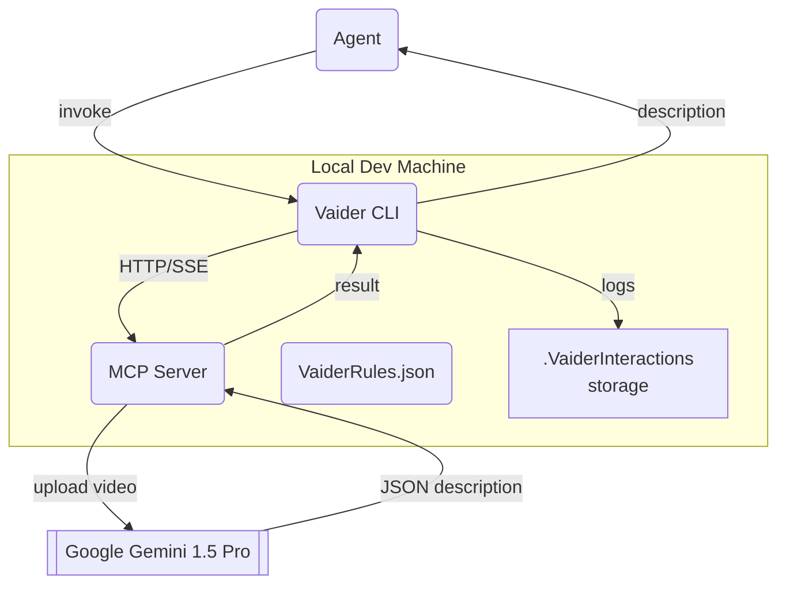

# Vaider Technical Specification

## 1. Scope and Purpose

This document describes the architecture, components, data flow, and operational requirements of **Vaider** version 1. It is intended for developers who will build, maintain, or integrate the tool.

## 2. Background

Vaider provides AI-powered video interpretation for GUI test automation. It bridges recorded Playwright videos with LLM-based vision models (initially Google Gemini 1.5 Pro) so that an autonomous coding agent can validate UI behaviour.

## 3. High-Level Architecture



## 4. Components

1. **Vaider CLI**  
   • Discovers test video artefacts based on `video_trigger_pattern`.  
   • Sends analysis requests to the MCP server and caches responses.  
   • Exposes a simple command-line interface (`vaider analyse <video.mp4>`).

2. **MCP Server**  
   • Listens on `http://localhost:3456` (configurable).  
   • Accepts `POST /analyse` with multipart video upload.  
   • Streams progress via Server-Sent Events (SSE).  
   • Translates requests/responses between Vaider CLI and the Vision model provider.

3. **Vision Model Adapter**  
   • Implements Gemini 1.5 Pro HTTP API.  
   • Responsible for prompt templating, retries, and timeout handling.

4. **Storage Folder** (`<video>.VaiderInteractions/`)  
   • Persists raw requests, model responses, and debug logs for troubleshooting.

5. **Configuration Files**  
   • `.cursor/mcp.json` – tells Cursor/Agent where the MCP server is.  
   • `VaiderRules.json` – instructs the Agent when and how to invoke Vaider.

## 5. Detailed Data Flow

1. Playwright finishes a test and emits `test-output/foo.mp4`.  
2. Agent (via VaiderRules) calls `vaider analyse test-output/foo.mp4`.  
3. CLI packages video and sends to MCP → Gemini.  
4. Gemini returns a textual timeline of on-screen events.  
5. CLI stores interaction logs and passes description to the Agent.  
6. Agent compares description vs. expectations; may retry up to five times.

## 6. Configuration Parameters

| Setting | Location | Default | Description |
|---------|----------|---------|-------------|
| `transport` | `.cursor/mcp.json` | `http` | Transport between Agent and Vaider |
| `url` | `.cursor/mcp.json` | `http://localhost:3456` | MCP base URL |
| `video_trigger_pattern` | `VaiderRules.json` | `test-output/**/*.mp4` | Glob for video discovery |
| `analysis_timeout_seconds` | `VaiderRules.json` | `30` | Max time to wait for analysis |
| `on_mismatch` | `VaiderRules.json` | `retry` | Action when description mismatches |
| `max_retries` | `VaiderRules.json` | `5` | Max analysis attempts per test |

## 7. API Specification (MCP)

```
POST /analyse
Content-Type: multipart/form-data
Body: video=<file>, metadata={json}
Response 200: { "description": "…", "duration_ms": 12345 }
Response 500: { "error": "…" }
```

Server-Sent Events endpoint (`/events`) provides real-time progress updates.

## 8. Error & Retry Strategy

• Gemini errors → exponential backoff (max 3 retries).  
• Timeouts → abort analysis, return error to Agent.  
• CLI retries analysis according to `max_retries`.  
• After final failure, Agent notifies developer.

## 9. Security Considerations

• MCP binds only to `localhost` by default.  
• API keys are read from environment variables and never written to disk.  
• All logs stored in `.VaiderInteractions` exclude sensitive credentials.

## 10. Deployment & Setup

1. `pip install vaider` (or `npm install -g vaider` once published).  
2. Export `GOOGLE_API_KEY=…`.  
3. Run `vaider mcp --port 3456`.  
4. Add `.cursor/mcp.json` and `VaiderRules.json` to the project.

## 11. Roadmap (Tech-Spec View)

* V1 – Single-threaded, single-model support (Gemini).  
* V1.1 – Pluggable model adapters.  
* V2 – Parallel analysis queue, Web UI dashboard, additional vision models.  
* V3 – Cloud-hosted SaaS mode.

---

_Authors: Steve Halsey  
Last updated: <!-- date will be substituted by commit log -->_ 