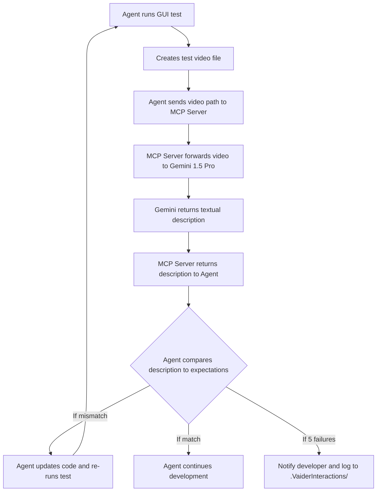

# Vaider Technical Specification - DRAFT - V002

## 1. System Architecture

### 1.1 Data Flow

The data flow in the Vaider system enables the Agent to interpret GUI behavior via video analysis. The process is as follows:

1. **Test Execution**: The Agent runs a GUI test (e.g., Playwright), which produces a video file of the test execution (e.g., `test-output/test-abc/test-abc.mp4`).
2. **Video Submission**: The Agent sends the path to this video file to the local MCP Server via HTTP.
3. **Forwarding to Gemini**: The MCP Server receives the path, reads the video, and forwards it to the Google Gemini 1.5 Pro API for interpretation.
4. **Receiving Description**: Gemini returns a textual description of the video contents to the MCP Server.
5. **Agent Decision**: The MCP Server sends the description back to the Agent. The Agent compares it with expected outcomes.
6. **Looping and Logging**: If mismatches exist, the Agent revises and reruns the test (up to 5 times). All requests and responses are logged to a `.VaiderInteractions/` folder for inspection.

#### Diagram



### 1.2 Key Components

The Vaider system consists of several key components, each with a specific role in enabling automated video analysis and test validation:

1. **Agent**

   * The AI developer assistant responsible for writing and executing GUI tests.
   * Detects `.mp4` test videos and triggers the Vaider workflow.
   * Compares the textual description with expected outcomes and adjusts code or test logic if mismatches are found.

2. **MCP Server (Message Communication Protocol Server)**

   * A lightweight local HTTP/SSE server that acts as a relay between the Agent and the video analysis service.
   * Receives the video path from the Agent, streams the video to Gemini, and returns the analysis result.
   * Designed to run on `localhost` to avoid external exposure.

3. **Vaider Tooling Layer**

   * Includes the `VaiderRules` configuration file, which guides Agent behaviour (e.g., retry strategy, timeouts).
   * Also encompasses logging and diagnostics infrastructure (e.g., `.VaiderInteractions/` folder) to support debugging and user insight.

4. **Google Gemini 1.5 Pro API**

   * Cloud-based video interpretation service that returns detailed, step-by-step textual descriptions.
   * Currently the only supported video model in v1.
   * Requires a paid API key managed via environment variable or config.

### 1.3 Security Measures

The Vaider system is designed with a minimal but effective security posture suitable for local development environments. Key measures include:

1. **Localhost-only Binding**

   * The MCP Server is configured to listen only on `localhost`, ensuring it is not accessible from remote machines.
   * This default setting helps prevent accidental exposure of the developer's local tools or data to the internet.

2. **API Key Handling**

   * The Google Gemini API requires a paid key, which must be stored securely.
   * Developers are instructed to load the key from a local environment variable (e.g., `GOOGLE_API_KEY`) or a `.env` file excluded from version control (e.g., via `.gitignore`).
   * The key should never be hardcoded into scripts or committed to repositories.

3. **Privacy of Test Artifacts**

   * Test video files and associated `.VaiderInteractions/` folders are stored locally, not uploaded or shared outside the analysis pipeline.
   * These directories include request/response logs that may contain sensitive UI state — developers are responsible for securing this content if needed.

4. **No Persistent External State**

   * Vaider operates in a stateless fashion with regard to external services: no persistent identifiers, user profiles, or file storage is maintained outside the user's local machine and the temporary Gemini API transaction.

---

## 2. Dependencies

The Vaider system relies on the following external services and libraries:

### 2.1 External Services

1. **Google Gemini 1.5 Pro API**

   * Provides the video-to-text interpretation capability.
   * Requires an internet connection and a paid API key.

2. **Cursor Platform**

   * The Agent operates within Cursor and uses `.cursor/mcp.json` to define available tools like Vaider.

### 2.2 Local and Development Dependencies

1. **HTTP/SSE Server Runtime**

   * A lightweight server (Node.js, Python/FastAPI, or similar) to implement the MCP Server logic.

2. **Environment Variable Loader**

   * E.g., `dotenv` or similar library for loading API keys from `.env` files.

3. **JSON Handling and HTTP Client Libraries**

   * Used to parse requests and send data to Gemini.
   * E.g., `requests` in Python or `axios` in JavaScript.

4. **File System Access Libraries**

   * Required to access `.mp4` video files and manage `.VaiderInteractions/` logs.

These dependencies should be modular and lightweight to keep the tool accessible for local prototyping and open-source use.


## 3. MCP Server Technical Details

* **Purpose**: The MCP (Message Communication Protocol) server allows the AI agent to communicate with the Vaider tool for video analysis.

* **Architecture**:

  * The MCP server runs locally on the developer's machine, listening on a specified port. By default, it listens only on localhost to avoid any unintended remote exposure.
  * It is configured to use HTTP/SSE (Server-Sent Events) transport for communication in version 1.
  * The server acts as a bridge between the Agent and the video analysis service (Google Gemini 1.5 Pro).

* **Configuration**:

  * Developers should configure HTTP transport by setting the appropriate configuration in the `.cursor/mcp.json` file.
  * Example HTTP configuration:

    ```json
    {
      "tools": {
        "vaider": {
          "transport": "http",
          "url": "http://localhost:3456"
        }
      }
    }
    ```

* **Workflow**:

  * When the Agent completes a GUI test, it sends the video file path to the MCP server.
  * The MCP server forwards the video to the configured video analysis service and returns the textual description to the Agent.
  * The communication protocol ensures that the Agent can seamlessly request and receive video analysis results in real-time.

* **Benefits Of HTTP/SSE Over Stdio Option**:

  * Easier testing and debugging due to the ability to interact with the server via standard web tools when using HTTP.
  * Flexibility in transport options allows developers to choose the method that best fits their development environment.

* **Error Handling**:

  * If an error occurs, the MCP server returns an HTTP 500 response with a JSON-formatted body describing the issue. This allows the Agent to gracefully detect and log failures.


---

## 3.1 HTTP API Contract (MCP ⇄ Agent)

### Endpoint Summary

| Method | Path | Purpose |
|--------|------|---------|
| POST   | `/v1/analyse` | Submit a GUI-test video for analysis |
| GET    | `/v1/health`  | Liveness probe for CI / Agent |

### 3.1.1 `POST /v1/analyse`

```http
POST /v1/analyse HTTP/1.1
Host: localhost:3456
Content-Type: application/json
Authorization: Bearer <CURSOR_TOOL_TOKEN>

{
  "videoPath": "test-output/test-abc/test-abc.mp4",
  "timeoutSec": 30  // optional; defaults to 30 s if omitted
}
```

**Response – success (200):**
```jsonc
{
  "description": "1. The app launches… 2. User taps Login … 3. Dashboard loads …",
  "framesAnalysed": 1872,
  "model": "Gemini-1.5-Pro",
  "durationMs": 12894
}
```

**Errors & Example JSON Responses**

* **400 – `INVALID_PATH`**  
  Video file not found / unreadable.
  ```jsonc
  {
    "error": {
      "code": "INVALID_PATH",
      "message": "Video file not found: test-output/foo.mp4"
    }
  }
  ```

* **408 – `TIMEOUT`**  
  Gemini call exceeded `timeoutSec`.
  ```jsonc
  {
    "error": {
      "code": "TIMEOUT",
      "message": "Gemini processing exceeded 30 s timeout"
    },
    "durationMs": 30015
  }
  ```

* **500 – `UPSTREAM_ERROR`**  
  Gemini service outage or network failure.
  ```jsonc
  {
    "error": {
      "code": "UPSTREAM_ERROR",
      "message": "Gemini API returned status 503 – Service Unavailable"
    },
    "upstreamResponse": {
      "status": 503,
      "body": "<html>Service Unavailable</html>"
    }
  }
  ```

### cURL Quick-test
```bash
curl -X POST http://localhost:3456/v1/analyse \
  -H "Content-Type: application/json" \
  -d '{"videoPath":"sample.mp4","timeoutSec":30}' | jq
```

### 3.1.2 `GET /v1/health`

This endpoint serves as a simple health check to confirm the MCP server is running and responsive. It can be used by the Agent or CI/CD pipelines as a liveness probe before sending analysis requests.

**Request:**
```http
GET /v1/health HTTP/1.1
Host: localhost:3456
```

**Response – success (200):**
```jsonc
{
  "status": "ok",
  "timestamp": "2023-10-27T10:00:00Z", // ISO 8601 format
  "version": "0.1.0" // Server version
}
```

**cURL Quick-test:**
```bash
curl http://localhost:3456/v1/health | jq
```

---

## 3.2 MCP Server Implementation Plan

| Topic | Decision |
|-------|----------|
| **Language** | *Python 3.11 + FastAPI/Uvicorn* embedded – single-file server module.<PLACEHOLDER>
| **Video Upload** | Use Gemini Python SDK `genai.upload_file(path)` helper, poll until the file state becomes `ACTIVE`, then pass the returned file handle to `model.generate_content(...)`. |
| **Concurrency** | `--workers 5` flag passed to the server start command (default across environments). |
| **Start Command** | `python -m vaider_mcp.server --port 3456 --workers 5`  (FastAPI+Uvicorn) |
| **Deps** | `fastapi`, `uvicorn[standard]`, `python-dotenv`, `requests`, `ffmpeg-python` (optional). |
| **Performance Goal** | ≤ 30 s wall-clock for 20 MB input on M1 Mac (measured via `time curl …`). |


---

### Reference Links

* FastAPI docs – <https://fastapi.tiangolo.com/>  
* Streaming multipart with `requests` – <https://requests.readthedocs.io/en/latest/user/advanced/#streaming-uploads>  
* ffmpeg-python – <https://github.com/kkroening/ffmpeg-python>  
* JSON Schema Draft 2020-12 – <https://json-schema.org/>  
* OWASP API Security Top 10 – <https://owasp.org/API-Security/>  


## 4. VaiderRules Configuration File

* **Purpose**: Tells the Agent when and how to use Vaider.
  **Format**: Plain text, English human readable format.
* **Variables Set At Top Of File**:
  - video_not_matching_ai_expectations_retry_limit = 5 
  - vaider_not_working_retry_limit = 3
  - timeout_waiting_for_vaider_response_seconds = 30

* **Agent Introduction**:

  > "You have access to a new tool called Vaider which can interpret videos of GUI tests. Whenever a Playwright test produces a video, use Vaider to interpret what happened on screen and validate it against expectations."

* **When to Use**:

  * If a GUI-related test is run and a `.mp4` is generated.
  * Always analyze test videos.
  * Retry up to `video_not_matching_ai_expectations_retry_limit times` if mismatches exist.
  * After `video_not_matching_ai_expectations_retry_limit times` failed attempts, stop and notify coder telling it the full `.VaiderInteractions` folder path where they can see the full sequence of requests/responses.

* **Handling Vaider Results**:

  * The Agent uses the description from Vaider to validate against expectations.
  * If mismatches are found, the Agent re-attempts the test up to the retry limit.
  * After reaching the retry limit, the Agent stops and alerts the developer.

* **Handling Errors or Timeouts**:

  * If Vaider fails to return results due to error or timeout, retry up to `vaider_not_working_retry_limit` times.
  * After that, log the failure, notify the developer and await further instructions.

## 5. Cursor Integration

* Via `.cursor/mcp.json`
* Tool name: `vaider`
* URL: `http://localhost:3456`

## 6. Video Storage

* Folder: `test-output/test-name.mp4.VaiderInteractions/`
* Contains: request/response logs (possibly optional status/debug logs?)


## 7. Experimental Programs

During development of the project a number of experimental programs will be used to try out various technologies employed in the system before working on the production code. These will include:

- One that creates and runs a simple Hello World MCP server that can be run and tested by an Agent that just says "Hello Agent" and tells it the current time.
- One that takes a test-input video file and sends it to Gemini to get a description of it.


7. **Future Extensibility Hooks**
   - Interface/adapter pattern for plugging in additional video models (Claude, OpenAI, open-source).
## 8. Future Extensibility Hooks

To ensure Vaider remains adaptable and is not tightly coupled to a single AI provider, the MCP server will be designed with a pluggable architecture for its video analysis backend. This will be achieved using the **Adapter Pattern**.

### 8.1 Core Interface

A common interface, let's call it `VideoAnalysisService`, will define the contract for any video processing backend.

```python
from abc import ABC, abstractmethod

class VideoAnalysisResult:
    """Dataclass to hold the analysis result."""
    description: str
    model_name: str
    duration_ms: int
    raw_response: dict # For logging/debugging

class VideoAnalysisService(ABC):
    """Abstract base class for a video analysis service provider."""

    @abstractmethod
    def analyse_video(self, video_path: str, timeout_sec: int) -> VideoAnalysisResult:
        """
        Takes a path to a video file and returns a structured analysis result.
        
        This method should handle all provider-specific logic, including:
        - API authentication
        - File uploading/streaming
        - Calling the model endpoint
        - Parsing the response into a common format
        - Error handling and raising standardized exceptions
        """
        pass

    @property
    @abstractmethod
    def provider_name(self) -> str:
        """Returns the name of the provider (e.g., 'GoogleGemini', 'OpenAI')."""
        pass
```

### 8.2 Concrete Implementations

For each supported AI model, a concrete class will implement the `VideoAnalysisService` interface.

**Example for Gemini (current implementation):**
```python
class GeminiVideoService(VideoAnalysisService):
    def __init__(self, api_key: str):
        # ... initialization logic for the Gemini client ...

    def analyse_video(self, video_path: str, timeout_sec: int) -> VideoAnalysisResult:
        # ... logic to upload file to Gemini and get description ...
        return VideoAnalysisResult(...)

    @property
    def provider_name(self) -> str:
        return "GoogleGemini"
```

**Future adapter for OpenAI:**
```python
class OpenAIVideoService(VideoAnalysisService):
    def __init__(self, api_key: str):
        # ... initialization logic for the OpenAI client ...

    def analyse_video(self, video_path: str, timeout_sec: int) -> VideoAnalysisResult:
        # ... logic to call GPT-4V with video and get description ...
        return VideoAnalysisResult(...)

    @property
    def provider_name(self) -> str:
        return "OpenAI"
```

### 8.3 Configuration and Selection

The active video analysis service will be determined by a configuration setting, for example in a `vaider.conf` file or an environment variable. The MCP server will use a factory function to instantiate the correct adapter at startup.

**Example `vaider.conf` setting:**
```ini
# vaider.conf
[analysis]
provider = "GoogleGemini"
# provider = "OpenAI" # Future option
```

**Factory logic in the server:**
```python
def get_analysis_service(config) -> VideoAnalysisService:
    provider = config.get("analysis", "provider")
    api_key = os.getenv(f"{provider.upper()}_API_KEY") # e.g., GOOGLEGEMINI_API_KEY

    if provider == "GoogleGemini":
        return GeminiVideoService(api_key=api_key)
    elif provider == "OpenAI":
        return OpenAIVideoService(api_key=api_key)
    else:
        raise ValueError(f"Unsupported provider: {provider}")

# Server startup
# service = get_analysis_service(load_config())
# service.analyse_video(...)
```

This approach will allow new video analysis models to be added in the future with minimal changes to the core server logic, simply by adding a new adapter class and updating the factory function.

## 9. API Data Validation

To improve the robustness and maintainability of the MCP server, all incoming API requests will be validated using data models. Since the implementation plan calls for Python with FastAPI, this will be handled idiomatically using Pydantic models.

### 9.1 Benefits

*   **Automatic Validation:** FastAPI will automatically validate incoming request bodies against the Pydantic models. If the data is malformed (e.g., a required field is missing, a field has the wrong data type), FastAPI will automatically return a descriptive HTTP 422 (Unprocessable Entity) error. This eliminates the need for manual validation logic.
*   **Self-Documenting Code:** The Pydantic models serve as a clear, in-code definition of the API's expected data structures.
*   **Enhanced Developer Experience:** These models provide excellent autocompletion and type-checking support in modern code editors, reducing the chance of common programming errors.

### 9.2 Example Implementation

Instead of handling raw dictionary objects, the `/v1/analyse` endpoint will expect a body that conforms to an `AnalyseRequest` model.

```python
from pydantic import BaseModel, FilePath
from typing import Optional

class AnalyseRequest(BaseModel):
    videoPath: FilePath  # Validates that the file path exists.
    timeoutSec: Optional[int] = 30  # An optional field with a default value.

# In the FastAPI endpoint:
# @app.post("/v1/analyse")
# async def analyse_endpoint(request: AnalyseRequest):
#     # FastAPI ensures that 'request' is a valid instance of AnalyseRequest.
#     # You can now safely access request.videoPath and request.timeoutSec.
#     ...
```

This practice ensures that the server's business logic only ever deals with data that has been confirmed to be valid and well-structured, making the entire application more reliable.